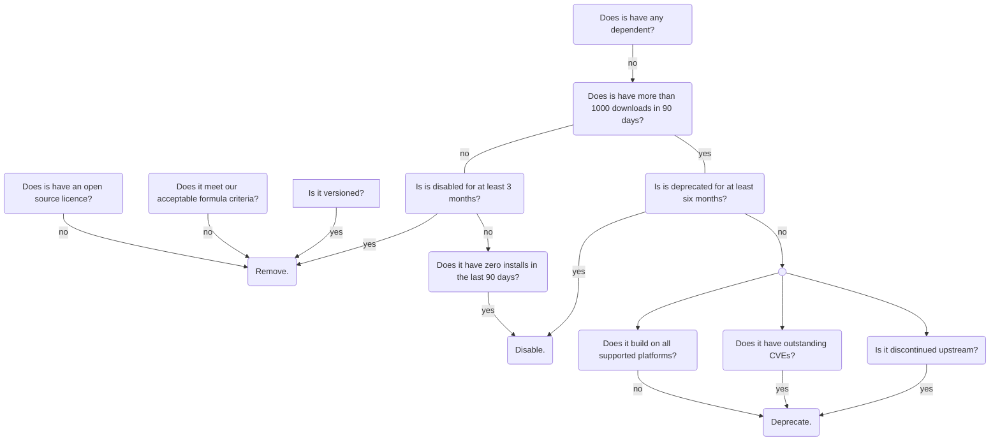

# Deprecating, Disabling and Removing Formulae

There are many reasons why formulae may be deprecated, disabled or removed. This document explains the differences between each method as well as explaining when one method should be used over another.

## Overview

These general rules of thumb can be followed:

- `deprecate!` should be used for formulae that _should_ no longer be used.
- `disable!` should be used for formulae that _cannot_ be used.
- Formulae that are no longer acceptable in `homebrew/core` or have been disabled for over a year _should_ be removed.

## Flow



## Deprecation

If a user attempts to install a deprecated formula, they will be shown a warning message but the install will proceed.

A formula should be deprecated to indicate to users that the formula should not be used and will be disabled in the future. Deprecated formulae should continue to be maintained by the Homebrew maintainers so they still build from source and their bottles continue to work (even if unmaintained upstream). If this is not possible, they should be disabled.

The most common reasons for deprecation are when the upstream project is deprecated, unmaintained, or archived.

Formulae with dependents should not be deprecated until or when all dependents are also deprecated.

To deprecate a formula, add a `deprecate!` call. This call should include a deprecation date (in the ISO 8601 format) and a deprecation reason:

```ruby
deprecate! date: "YYYY-MM-DD", because: :reason
```

The `date` parameter should be set to the date that the deprecation period should begin, which is usually today's date. If the `date` parameter is set to a date in the future, the formula will not become deprecated until that date. This can be useful if the upstream developers have indicated a date when the project or version will stop being supported. Do not backdate the `date` parameter as it causes confusion for users and maintainers.

The `because` parameter can be a preset reason (using a symbol) or a custom reason. See the [Deprecate and Disable Reasons](#deprecate-and-disable-reasons) section below for more details about the `because` parameter.

## Disabling

If a user attempts to install a disabled formula, they will be shown an error message and the install will fail.

A formula should be disabled to indicate to users that the formula cannot be used and will be removed in the future. Disabled formulae may no longer build from source or have working bottles.

To disable a formula, add a `disable!` call. This call should include a deprecation date in the ISO 8601 format and a deprecation reason:

```ruby
disable! date: "YYYY-MM-DD", because: :reason
```

The `date` parameter should be set to the date that the reason for disabling came into effect. If there is no clear date but the formula needs to be disabled, use today's date. If the `date` parameter is set to a date in the future, the formula will be deprecated until that date (on which the formula will become disabled).

The `because` parameter can be a preset reason (using a symbol) or a custom reason. See the [Deprecate and Disable Reasons](#deprecate-and-disable-reasons) section below for more details about the `because` parameter.

## Removal

A formula should be removed if it does not meet our criteria for [acceptable formulae](Acceptable-Formulae.md) or [versioned formulae](Versions.md), has a non-open-source license, or has been disabled for over a year.

## Deprecation - Disabling - Removal flow


## Deprecate and Disable Reasons

When a formula is deprecated or disabled, a reason explaining the action must be provided.

There are two ways to indicate the reason. The preferred way is to use a pre-existing symbol to indicate the reason. The available symbols are listed below and can be found in the [`DeprecateDisable` module](https://github.com/Homebrew/brew/blob/master/Library/Homebrew/deprecate_disable.rb):

- `:does_not_build`: the formula cannot be built from source on any supported macOS version or Linux.
- `:no_license`: we cannot identify a license for the formula
- `:repo_archived`: the upstream repository has been archived and no replacement is pointed to that we can use
- `:repo_removed`: the upstream repository has been removed and no replacement is mentioned on the homepage that we can use
- `:unmaintained`: the project appears to be abandoned i.e. it has had no commits for at least a year and has critical bugs or CVE that have been reported and gone resolved longer. Note: some software is "done"; a lack of activity does not imply a need for removal.
- `:unsupported`: Homebrew's compilation of the software is not supported by the upstream developers (e.g. upstream only supports macOS versions older than 10.15)
- `:deprecated_upstream`: the project is deprecated upstream and no replacement is pointed to that we can use
- `:versioned_formula`: the formula is a versioned formula and no longer [meets the requirements](Versions.md).
- `:checksum_mismatch`: the checksum of the source for the formula's current version has changed since bottles were built and we cannot find a reputable source or statement justifying this

These reasons can be specified by their symbols (the comments show the message that will be displayed to users):

```ruby
# Warning: <formula> has been deprecated because it is deprecated upstream!
deprecate! date: "2020-01-01", because: :deprecated_upstream
```

```ruby
# Error: <formula> has been disabled because it does not build!
disable! date: "2020-01-01", because: :does_not_build
```

If these pre-existing reasons do not fit, a custom reason can be specified. Such reasons should be written to fit into the sentence `<formula> has been deprecated/disabled because it <reason>!`.

A well-worded example of a custom reason would be:

```ruby
# Warning: <formula> has been deprecated because it fetches unversioned dependencies at runtime!
deprecate! date: "2020-01-01", because: "fetches unversioned dependencies at runtime"
```

A poorly-worded example of a custom reason would be:

```ruby
# Error: <formula> has been disabled because it invalid license!
disable! date: "2020-01-01", because: "invalid license"
```
